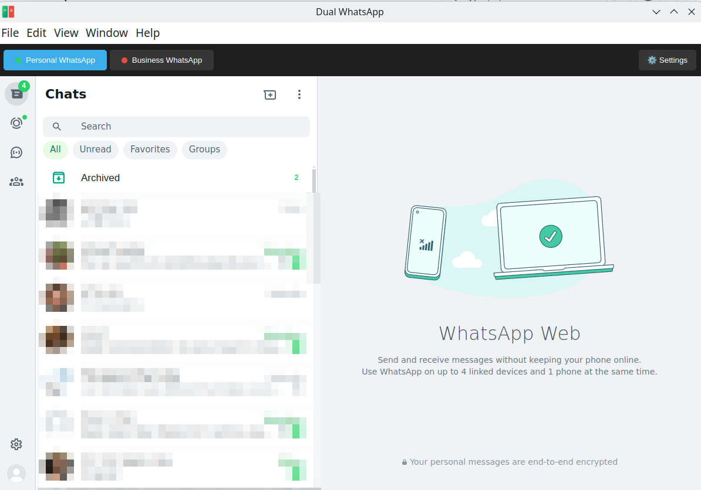
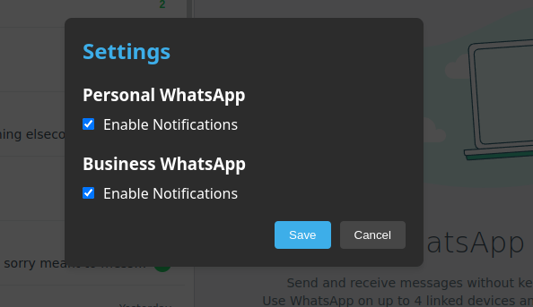
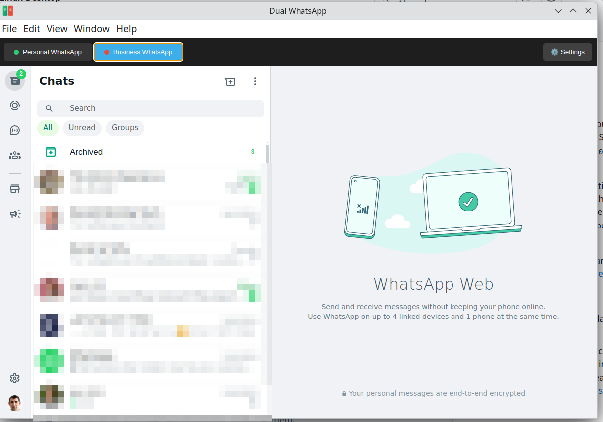
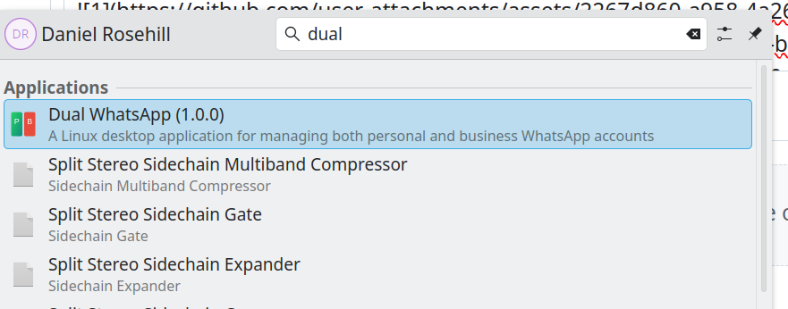

# Dual WhatsApp Client for Linux Desktop




## What This Is

A Linux desktop application that allows you to use both Personal and Business WhatsApp accounts simultaneously. Built specifically for Linux with KDE Plasma integration, but works on other desktop environments as well.

## Features

- Side-by-side tabbed layout for Personal and Business WhatsApp
- System tray integration with minimize to tray functionality
- Independent notification controls for each account
- Clean, modern interface matching KDE Plasma's aesthetic
- Persistent sessions for both accounts
- Settings management for notifications
- Automatic hiding of WhatsApp download banners

## Installation

Download the latest AppImage from the releases page and make it executable:

```bash
chmod +x Dual-WhatsApp-*.AppImage
```

Then simply run the AppImage to launch the application.

## Screenshots Gallery

<div style="display: grid; grid-template-columns: repeat(2, 1fr); gap: 20px; margin: 20px 0;">
    
    
    
    
</div>

## Usage

1. Launch the application by running the AppImage
2. Sign in to your Personal WhatsApp account in the left tab
3. Sign in to your Business WhatsApp account in the right tab
4. Use the settings gear icon to configure notification preferences
5. Minimize to system tray by clicking the close button

## Development Notes

The application is built using:
- Electron
- electron-store for settings persistence
- Standard web technologies (HTML, CSS, JavaScript)

## License

ISC License
